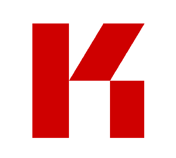

<div align="center">
  
  
  # KR-Labs Model Zoo
  **Open Models. Trusted Intelligence. Shared Progress.**
  
  [](https://pypi.org/project/krl-model-zoo/)
  [](https://pypi.org/project/krl-model-zoo/)
  [](LICENSE)
  [](https://www.python.org/downloads/)
  [](https://krl-model-zoo.readthedocs.io)
  [](https://github.com/KR-Labs/krl-model-zoo)
  [](https://github.com/psf/black)
  
  [📚 Documentation](https://krl-model-zoo.readthedocs.io) • [🚀 Quick Start](#quick-start) • [💡 Examples](./examples) • [🤝 Contributing](CONTRIBUTING.md)
</div>

---

## 🌟 Highlights

- 🎯 **100+ Production-Ready Models** - ARIMA, GARCH, VAR, Kalman Filters, Random Forest, XGBoost, and more
- 📊 **Built for Public Data** - Native integration with Census, BLS, FRED, CDC, HUD via [KRL Data Connectors](https://github.com/KR-Labs/krl-data-connectors)
- 🔬 **Research-Grade Quality** - Peer-reviewed algorithms with comprehensive validation and testing
- 🚀 **Production Ready** - Battle-tested in real-world policy analysis and forecasting applications
- 📖 **Fully Documented** - Complete API reference, tutorials, and mathematical formulations
- 🤝 **Open Source** - Apache 2.0 License, community-driven development

---

## Overview

**KRL Model Zoo™** is an open-source library of socioeconomic and econometric models designed for **researchers, policymakers, analysts, and community organizations** seeking to turn data into actionable intelligence.  

It provides modular, production-grade tools for forecasting, regional analysis, anomaly detection, and policy evaluation — all engineered with transparency, reproducibility, and accessibility in mind.

Developed by **KR-Labs**, the Model Zoo bridges statistical rigor with public-interest purpose, transforming raw data into real-world insight.

### Integrated Ecosystem

The Model Zoo is designed to work seamlessly with **[KRL Data Connectors](https://github.com/KR-Labs/krl-data-connectors)**, our companion library for accessing public datasets. Together, they provide an end-to-end workflow:

**Data → Analysis → Insight**

- **KRL Data Connectors** pulls data from Census, BLS, FRED, CDC, HUD, and 20+ other federal sources
- **KRL Model Zoo** applies statistical models and analytical frameworks
- **Results** drive evidence-based decisions and policy evaluation

---

## Mission

We believe data science should serve humanity.  
The KRL Model Zoo exists to make **responsible, interpretable, and replicable analytics** accessible to everyone shaping economic, social, or community outcomes.  

Our models support research, governance, and education by standardizing open methods for understanding change.

---

## Core Capabilities

- **Unified Framework:** Econometric, causal, ML, and Bayesian models under one architecture.  
- **Transparency by Design:** Built-in provenance tracking, version control, and reproducibility.  
- **Seamless Data Integration:** Native compatibility with KRL Data Connectors for federal datasets.  
- **Community-Driven:** Collaborative ecosystem for model sharing, validation, and continuous improvement.  
- **Policy-Ready Tools:** Designed for public datasets like Census, BLS, FRED, CDC, and HUD.  
- **Educational Utility:** Ideal for universities, research institutes, and civic technology programs.  

---

## Model Families

| Domain | Example Models | Use Case |
|--------|----------------|-----------|
| **Time Series Analysis** | ARIMA, SARIMA, GARCH, Kalman Filters | Forecasting unemployment, prices, or economic volatility |
| **Econometrics** | VAR, Cointegration, Structural Breaks | Studying policy impacts and long-term relationships |
| **Regional Analysis** | Location Quotient, Shift-Share | Understanding regional economic specialization |
| **Anomaly Detection** | STL Decomposition, Isolation Forest | Identifying shocks and unusual patterns in public data |
| **Extensions** | Causal Inference, Bayesian Hierarchies, Network Models | Enterprise Applications |

---

## Practical Impact

The Model Zoo powers work that matters:  

- **Labor & Employment:** Forecasting job trends, analyzing workforce shifts, and tracking equity gaps.  
- **Housing & Urban Development:** Modeling affordability, detecting displacement, and identifying price volatility.  
- **Income & Inequality:** Measuring economic disparity, mobility, and opportunity over time.  
- **Public Health:** Linking health indicators with economic and environmental conditions.  
- **Regional Development:** Assessing industrial strengths, resilience, and competitiveness.  

Each model is field-tested, policy-relevant, and community-accessible.

---

## Quick Start

### Installation

**Install from PyPI** (recommended):
```bash
pip install krl-model-zoo
```

**Install with optional dependencies**:
```bash
# For development
pip install krl-model-zoo[dev]

# For testing
pip install krl-model-zoo[test]

# For documentation
pip install krl-model-zoo[docs]

# All optional dependencies
pip install krl-model-zoo[all]
```

**Install from source**:
```bash
git clone https://github.com/KR-Labs/krl-model-zoo.git
cd krl-model-zoo
pip install -e .
```

**Complete ecosystem setup**:
```bash
# Install Model Zoo + Data Connectors for seamless data access
pip install krl-model-zoo krl-data-connectors
```

### Complete Workflow Example
```python
# Step 1: Fetch data using KRL Data Connectors
from krl_data_connectors import BLSConnector, CensusConnector

# Get unemployment data from BLS
bls = BLSConnector()
unemployment_data = bls.get_series('LNS14000000', start_year=2015, end_year=2024)

# Get regional employment from Census
census = CensusConnector()
regional_data = census.get_cbp_data(year=2023, geography='county', state='06')

# Step 2: Analyze with Model Zoo
from krl_models.econometric import SARIMAModel
from krl_models import LocationQuotientModel

# Forecast unemployment trends
model = SARIMAModel(
    data=unemployment_data,
    params={'order': (1, 1, 1), 'seasonal_order': (0, 0, 0, 0)},
    meta={'name': 'unemployment_forecast', 'version': '1.0.0'}
)
result = model.fit()
forecast = model.predict(steps=12)

# Analyze regional specialization
lq = LocationQuotientModel(
    data=regional_data,
    params={
        'region_col': 'county',
        'industry_col': 'naics',
        'employment_col': 'emp'
    },
    meta={'name': 'regional_lq', 'version': '1.0.0'}
)
lq_result = lq.fit()

# Step 3: Export results for reporting or visualization
forecast.to_csv('unemployment_forecast.csv')
lq_result.to_excel('regional_analysis.xlsx')
```

### Standalone Usage (Without Data Connectors)
```python
from krl_models.econometric import SARIMAModel
from krl_models import STLAnomalyModel
import pandas as pd

# Use your own data
data = pd.read_csv('your_data.csv')

# Forecast with SARIMA
model = SARIMAModel(
    data=data,
    params={'order': (1, 1, 1), 'seasonal_order': (1, 1, 1, 12)},
    meta={'name': 'my_forecast', 'version': '1.0.0'}
)
result = model.fit()
forecast = model.predict(steps=12)

# Detect anomalies
anomaly_model = STLAnomalyModel(
    data=data,
    params={
        'time_col': 'date',
        'value_col': 'metric',
        'seasonal_period': 12,
        'threshold': 3.0
    },
    meta={'name': 'anomaly_detection', 'version': '1.0.0'}
)
anomalies = anomaly_model.fit()
```

### Explore Example Notebooks
Visit `/examples/notebooks/` for guided walkthroughs:  
- **End-to-End Workflows:** Fetching data with Connectors + analyzing with Model Zoo
- Forecasting labor market trends with BLS data
- Regional specialization analysis using Census CBP data  
- Housing market volatility with HUD Fair Market Rent data
- Anomaly detection in CDC health indicators
- Multi-source integration: combining FRED, BLS, and Census data  

---

## Community & Collaboration

KR-Labs thrives on **open collaboration** and shared intelligence.  

You can:
- Contribute new models, tutorials, or datasets  
- Report issues or propose features  
- Share research Mapplications and case studies  
- Join our growing community of open-data practitioners  

See our [Contributing Guide](./CONTRIBUTING.md) for details.  
Join the discussion at [GitHub Discussions](https://github.com/KR-Labs/krl-model-zoo/discussions).

---

## Governance & Roadmap

The Model Zoo evolves through the **KR-Labs Gate Framework**, ensuring transparent, high-quality development:

| Gate | Description | Status |
|------|--------------|---------|
| **Gate 1 – Foundation** | Time series & econometric core | Open-Source |
| **Gate 2 – Domain Models** | Regional & anomaly detection | Open-Source |
| **Gate 3 – Ensembles** | Meta-models and hybrid systems | Enterprise App|
| **Gate 4 – Advanced Extensions** | Causal inference, Bayesian, network models | Enterprise App |

Each Gate reflects a maturity milestone balancing innovation, stability, and community feedback.

---

## KR-Labs Ecosystem

The Model Zoo is part of a broader **open-source intelligence platform**:

| Repository | Purpose | Status |
|------------|---------|--------|
| **[krl-model-zoo](https://github.com/KR-Labs/krl-model-zoo)** | Statistical models & analytical frameworks | Production |
| **[krl-data-connectors](https://github.com/KR-Labs/krl-data-connectors)** | Unified API for 20+ federal data sources | Production |

### Why This Matters

**Traditional Approach:**
1. Manually download CSVs from multiple government websites
2. Write custom parsers for each data format
3. Clean and normalize data structures
4. Finally begin analysis

**KR-Labs Approach:**
1. `pip install krl-data-connectors krl-model-zoo`
2. Write analysis code immediately
3. Results in minutes, not days

**Key Benefits:**
- **Single API** for Census, BLS, FRED, CDC, HUD, and more
- **Pre-validated data** compatible with Model Zoo methods
- **Reproducible workflows** from data fetch to final analysis
- **Version control** for both data retrieval and model parameters
- **Community support** for common use cases and patterns

---

## Documentation

📚 **[Full Documentation on ReadTheDocs](https://krl-model-zoo.readthedocs.io/)** *(Coming Soon)*

### Quick Links

- **[Quickstart Guide](./docs/quickstart.rst)** – Get started in 5 minutes
- **[User Guide](./docs/user_guide/index.rst)** – Comprehensive usage documentation
- **[API Reference](./docs/api/index.rst)** – Complete API documentation
- **[Contributing Guide](./docs/contributing.rst)** – Join our open-source community
- **[Development Guide](./docs/development.rst)** – Architecture and development practices
- **[Testing Guide](./docs/testing.rst)** – Quality assurance and test framework

### Example Code

- **[Python Examples](./examples/)** – Standalone Python scripts demonstrating model usage
- **[Jupyter Notebooks](./examples/notebooks/)** – Interactive tutorials with real datasets

### Related Documentation

- **[KRL Data Connectors](https://github.com/KR-Labs/krl-data-connectors)** – Integrate with 20+ federal data sources  

---

## Licensing

- **Software:** [Apache 2.0 License](./LICENSE) – Free for academic and commercial use  
- **Documentation:** [CC-BY-SA-4.0](https://creativecommons.org/licenses/by-sa/4.0/)  

KR-Labs™ and KRL Model Zoo™ are trademarks of **Quipu Research Labs, LLC**, a subsidiary of **Sundiata Giddasira, Inc.**

---

## Citation

If you use the KRL Model Zoo in research or analysis, please cite:

```bibtex
@software{krl-model-zoo,
  author = {Deloatch, Brandon C.},
  title = {KRL Model Zoo: Open-Source Socioeconomic Modeling Framework},
  Year = {2025},
  publisher = {KR-Labs},
  version = {1.0.0},
  url = {https://github.com/KR-Labs/krl-model-zoo}
}
```

---

## Contact & Support

- **Website:** [krlabs.dev](https://krlabs.dev)  
- **Email:** support@krlabs.dev  
- **GitHub Discussions:** [Join the conversation](https://github.com/KR-Labs/krl-model-zoo/discussions)  

---

<div align="center">
  
  
  **KR-Labs™ | Building Open Intelligence for the Public Good**
  
  Version 1.0.0 • [Apache 2.0 License](./LICENSE)
  
</div>

---

## Legal & Trademark Notice

© 2025 KR-Labs. All rights reserved.

**KR-Labs™** and **KRL Model Zoo™** are trademarks of Quipu Research Labs, LLC, a subsidiary of Sudiata Giddasira, Inc.

**Software License:** [Apache 2.0](./LICENSE) – Free for commercial and academic use  
**Documentation License:** [CC-BY-SA-4.0](https://creativecommons.org/licenses/by-sa/4.0/)

---